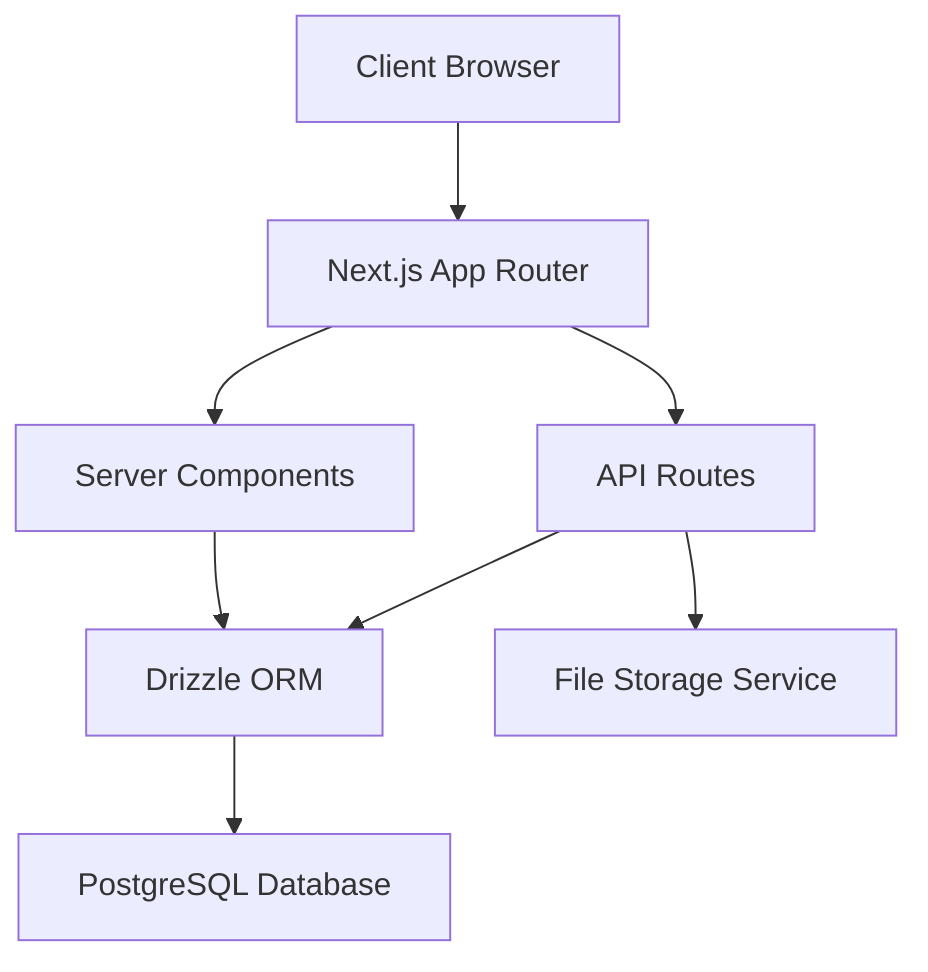

# Design Document

## Overview

The Appreciation Board platform is a Next.js web application that enables users to create digital appreciation boards similar to KudoBoard. The system uses PostgreSQL with Drizzle ORM for data persistence, Tailwind CSS 4 for styling, and shadcn components for UI elements. The architecture follows a modern full-stack approach with server-side rendering, API routes, and real-time updates.

## Architecture

### Technology Stack

- **Frontend**: Next.js 14+ with App Router
- **Database**: PostgreSQL with Drizzle ORM
- **Styling**: Tailwind CSS 4 + shadcn/ui components
- **File Storage**: Cloud storage service (AWS S3 or similar) for media files
- **Authentication**: Clerk Authentication with automatic user sync
- **Rich Text**: Tiptap or similar rich text editor

### System Architecture



## Components and Interfaces

### Database Schema

#### Users Table

```sql
users {
  id: varchar(255) (primary key) -- Clerk user ID
  name: varchar(255)
  email: varchar(255) (unique)
  avatar_url: varchar(255) (optional)
  created_at: timestamp
  updated_at: timestamp
}
```

#### Boards Table

```sql
boards {
  id: uuid (primary key)
  title: varchar(255)
  recipient_name: varchar(255)
  creator_id: varchar(255) (foreign key -> users.id)
  view_token: varchar(255) (unique)
  post_token: varchar(255) (unique)
  created_at: timestamp
  updated_at: timestamp
}
```

#### Posts Table

```sql
posts {
  id: uuid (primary key)
  board_id: uuid (foreign key -> boards.id)
  creator_id: varchar(255) (foreign key -> users.id)
  content: text (rich text JSON)
  media_urls: text[] (array of media file URLs)
  created_at: timestamp
  updated_at: timestamp
  is_deleted: boolean (default false)
}
```

### Core Components

#### User Authentication Components

- Registration form with name, email validation
- Login form with email authentication
- User profile display with avatar support
- Authentication state management

#### Board Creation Component

- Form with title and recipient name inputs (requires authentication)
- Generates unique view and post tokens
- Creates board record and redirects to management view
- Links board to authenticated user

#### Board View Component

- Displays board title and recipient
- Renders posts in masonry layout using CSS Grid or library
- Handles responsive design for different screen sizes
- Shows empty state when no posts exist
- Shows user info for each post (name, avatar)

#### Post Creation Component

- User authentication check before allowing posting
- Rich text editor with formatting toolbar
- Media upload interface with drag-and-drop
- File validation and preview functionality
- Submit handler that creates post record linked to user

#### Post Display Component

- Renders rich text content with preserved formatting
- Displays media with appropriate controls (video player, audio player)
- Shows edit button for creators within 10-minute window
- Includes moderation controls for board creators

#### Masonry Layout Component

- CSS Grid-based masonry implementation
- Responsive column count based on viewport
- Smooth animations for post additions/removals
- Optimized for performance with large numbers of posts

### API Endpoints

#### User Management

- `POST /api/auth/register` - Register new user
- `POST /api/auth/login` - User login
- `GET /api/auth/me` - Get current user info
- `POST /api/auth/logout` - User logout

#### Board Management

- `POST /api/boards` - Create new board (authenticated)
- `GET /api/boards/[viewToken]` - Get board and posts for viewing
- `GET /api/boards/[postToken]/post` - Get board info for posting

#### Post Management

- `POST /api/boards/[postToken]/posts` - Create new post (authenticated)
- `PUT /api/posts/[postId]` - Edit existing post (authenticated, with time validation)
- `DELETE /api/posts/[postId]` - Delete post (authenticated, creator only)

#### Media Management

- `POST /api/upload` - Upload media files (authenticated)
- File validation, processing, and storage

## Data Models

### User Model

```typescript
interface User {
  id: string;
  name: string;
  email: string;
  avatarUrl?: string;
  createdAt: Date;
  updatedAt: Date;
}
```

### Board Model

```typescript
interface Board {
  id: string;
  title: string;
  recipientName: string;
  creatorId: string;
  viewToken: string;
  postToken: string;
  createdAt: Date;
  updatedAt: Date;
}
```

### Post Model

```typescript
interface Post {
  id: string;
  boardId: string;
  creatorId: string;
  content: RichTextContent; // JSON structure for rich text
  mediaUrls: string[];
  createdAt: Date;
  updatedAt: Date;
  isDeleted: boolean;
}

interface RichTextContent {
  type: 'doc';
  content: Array<{
    type: string;
    attrs?: Record<string, any>;
    content?: RichTextContent[];
    text?: string;
  }>;
}
```

### Media Upload Model

```typescript
interface MediaUpload {
  file: File;
  type: 'image' | 'video' | 'audio';
  url?: string;
  uploadProgress?: number;
}
```

## Error Handling

### Client-Side Error Handling

- Form validation with real-time feedback
- File upload error handling with retry mechanisms
- Network error handling with user-friendly messages
- Loading states for all async operations

### Server-Side Error Handling

- Input validation using Zod schemas
- Database error handling with appropriate HTTP status codes
- File upload error handling with cleanup
- Rate limiting for API endpoints

### Error Boundaries

- React Error Boundaries for component-level error handling
- Global error handling for unhandled promise rejections
- Logging integration for error monitoring

## Testing Strategy

### Unit Testing

- Component testing with React Testing Library
- API route testing with Jest
- Database model testing with test database
- Utility function testing

### Integration Testing

- End-to-end user flows with Playwright
- API integration testing
- Database integration testing
- File upload integration testing

### Performance Testing

- Load testing for concurrent users
- Media upload performance testing
- Database query optimization testing
- Frontend performance monitoring

### Test Data Management

- Database seeding for consistent test data
- Mock data generators for various scenarios
- Test cleanup procedures
- Isolated test environments

## Security Considerations

### Authentication & Authorization

- Session-based authentication for board creators
- Token-based access control for board viewing/posting
- CSRF protection for state-changing operations
- Rate limiting to prevent abuse

### Data Validation

- Server-side validation for all inputs
- File type and size validation for uploads
- SQL injection prevention through ORM
- XSS prevention through content sanitization

### Media Security

- File type validation and sanitization
- Virus scanning for uploaded files
- Secure file storage with access controls
- Content delivery network for media serving

## Performance Optimizations

### Frontend Optimizations

- Image optimization with Next.js Image component
- Lazy loading for posts and media
- Virtual scrolling for large numbers of posts
- Code splitting and bundle optimization

### Backend Optimizations

- Database indexing for frequently queried fields
- Connection pooling for database connections
- Caching strategies for frequently accessed data
- CDN integration for static assets

### Media Optimizations

- Image compression and format optimization
- Video transcoding for web delivery
- Progressive loading for large media files
- Thumbnail generation for quick previews
